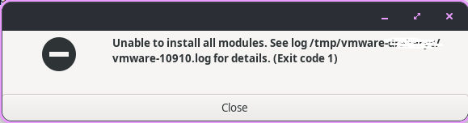
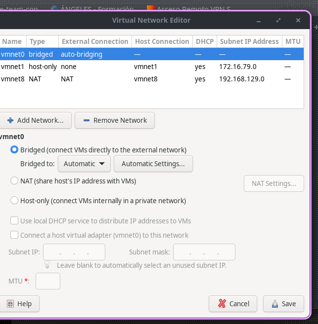
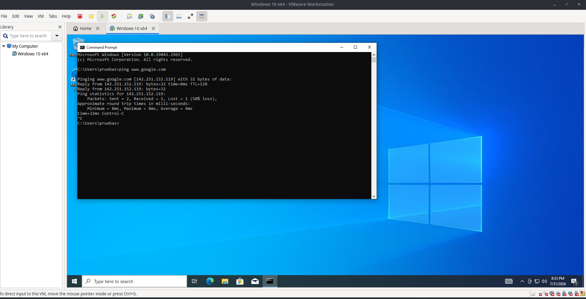

<div align="center">

# 🖥️ VMware Linux Fixes

### Fixing VMware kernel module compilation issues after upgrading VMware or updating to a recent Linux kernel.


Fix for **`vmmon`**, **`vmnet`**, **`/dev/vmmon`**, kernel module compilation failures and virtual machines failing to start after upgrading VMware or Linux.

</div>

---

## 📸 Symptoms

<p align="center">
  
</p>

Typical errors include:

- `Could not open /dev/vmmon`
- `Unable to install all modules`
- `vmmon/vmnet compilation failed`
- Virtual machines fail to start.

---

# 🧪 Tested Environment

| Component | Version |
|-----------|----------|
| VMware Workstation | 17.6.3 |
| Operating System | Pop!_OS 24.04 |
| Linux Kernel | 7.0.11-76070011-generic |

---

# 🔍 Root Cause

Recent Linux kernels are no longer compatible with the VMware host modules bundled with VMware Workstation 17.6.3.

Although VMware attempts to rebuild the modules automatically, the build may fail, resulting in missing `vmmon` / `vmnet` modules and `/dev/vmmon` errors.

This guide uses patched host modules to restore compatibility.

---

# 🚀 Installation

## 1. Remove your current VMware installation

```bash
sudo vmware-installer -u vmware-workstation
```

or uninstall VMware using the installer you originally used.

---

## 2. Download VMware Workstation 17.6.3

Download VMware Workstation **17.6.3** from the Broadcom Support Portal.

> ⚠️ This guide targets **17.6.3**.

Install it:

```bash
chmod +x VMware-Workstation-Full-17.6.3-*.bundle
sudo ./VMware-Workstation-Full-17.6.3-*.bundle
```

---

## 3. Install dependencies

```bash
sudo apt update

sudo apt install \
    build-essential \
    gcc \
    make \
    git \
    linux-headers-$(uname -r)
```

---

## 4. Download the correct repository

### ❌ Official repository

https://github.com/mkubecek/vmware-host-modules

At the time this guide was written it **does not include a `workstation-17.6.3` branch**.

### ✅ Working repository

```bash
git clone https://github.com/philipl/vmware-host-modules.git
cd vmware-host-modules
git checkout workstation-17.6.3
```

⚠️ **Do NOT use:**

```bash
git checkout w17.6.3
```

That is the original VMware source tag, **not** the patched branch.

---

## 5. Build

```bash
make
```

---

## 6. Install

```bash
sudo make install
```

---

## 7. Load the modules

```bash
sudo modprobe vmmon
sudo modprobe vmnet
```

Verify:

```bash
lsmod | grep vm
ls -l /dev/vmmon
```

---

# 🌐 Restore VMware Virtual Networks

If VMware starts but reports:

```text
Could not connect 'Ethernet0' to virtual network '/dev/vmnet8'
```

Run:

```bash
vmware-netcfg
```

Restore the default virtual networks (`vmnet0`, `vmnet1` and `vmnet8`).

<p align="center">
  
</p>

---

# ✅ Result

After following this guide, VMware should start normally and virtual machines should boot successfully.

<p align="center">
  
</p>

## ✔️ Verification

```bash
grep product.version /etc/vmware/config
uname -r
lsmod | grep vm
ls -l /dev/vmmon
sudo dmesg | grep -Ei "vmmon|vmnet"
```

Expected:

- ✅ `vmmon` loaded
- ✅ `vmnet` loaded
- ✅ `/dev/vmmon` exists
- ✅ `vmnet0`, `vmnet1` and `vmnet8` configured
- ✅ Virtual machines boot successfully

---

# ❤️ Credits

Special thanks to:

- VMware
- Broadcom
- mkubecek
- philipl

for maintaining VMware host module compatibility on modern Linux kernels.

---

⭐ If this guide helped you, consider starring the repository.
